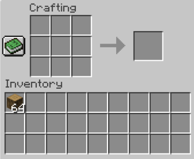

# Object-Oriented Minecraft Inventory and Crafting System
> Tugas Besar Mata Kuliah IF2210 Pemrograman Berorientasi Objek ITB.
> Built by Kelompok 8 - AFAKA

## Table of Contents
* [General Info](#general-information)
* [Features](#features)
* [Technologies Used](#technologies-used)
* [Setup](#setup)
* [Usage](#usage)
* [Project Status](#project-status)
* [Room for Improvement](#room-for-improvement)
* [Acknowledgements](#acknowledgements)
* [Contact](#contact)
<!-- * [License](#license) -->


## General Information
Sistem Inventory dan Crafting pada game Minecraft diterapkan pada program ini dengan menggunakan konsep OOP. Konsep OOP yang digunakan dalam program ini adalah Inheritance, Polymorphism, Function dan Operator Overloading, Abstract Class dan Virtual Function, Generic Function dan Generic Class, serta Standard Template Library (STL).



Mekanisme yang digunakan dalam program ini terdiri atas Item, Inventory, dan Crafting. Item bisa berupa Tool atau NonTool. Inventory bisa menyimpan Item ataupun membuang Item beserta memindahkan Item. Crafting dapat menerima Item dari Inventory serta sebaliknya dan juga dapat melakukan Craft untuk membuat Item.

## Features
Fitur (Command) yang terdapat dalam program ini:
- SHOW -> Menampikan isi dari Inventory dan CraftingTable ke Console
- GIVE  -> Menambahkan Item ke Inventory
- DISCARD -> Menghilangkan Item dari Inventory
- MOVE -> Memindahkan Item dari Inventory ke Inventory, Inventory ke CraftingTable, dan CraftingTable ke Inventory
- USE -> Menggunakan Item berupa Tool
- CRAFT -> Membuat Item berdasarkan resep tertentu
- EXPORT -> Meng-_Export_ isi dari Inventory ke sebuah file

## Technologies Used
- C++ 17 (diperlukan untuk menggunakan _library_ filesystem)

## Setup
Untuk menjalankan permainan dibutuhkan:
- g++
- make
- Linux

Untuk menggunakan program diperlukan _compile_ terhadap program dengan cara:
- _Copy_/_Download_ repository ini dan pastikan sudah menggunakan Linux (boleh WSL) dan sudah ter-_install_ make dan g++ pada Linux.
- Jika belum mempunyai _make dan g++ bisa _install_ dengan menggunakan _command_
```
sudo apt-get install build-essential
```
- Buka repository ini pada _root folder_-nya dan lakukan _command_
```
make compile
```
- File ``main.exe`` serta ``main`` akan terbuat


## Usage
Untuk menggunakan program yang telah di-_compile_:
- Gunakan salah satu _command_
```
./main
./main.exe
```
- Silahkan ketikkan Command yang tersedia pada program. "EXIT" untuk keluar dari program

Program juga bisa digunakan dengan menggunakan ``Makefile`` yang tersedia dengan cara:
- Jika ingin menambahkan test case, silahkan tambahakan pada folder ```tests``` dengan format file input ``.in`` dan jawaban dari test case tersebut dalam file ``.ans`` dengan nama file yang sama. Sebagai contoh, di dalam folder ``tests`` sudah terdapat 2 test case sehingga untuk menambahkan test case bole dilakukan dengan menambahkan file ``3.in`` dan ``3.ans``.
- Gunakan _command_
```
make all
```
- Program akan automatis di-compile dan akan menerima input dari semua file ``.in`` yang tersedia dan langsung dicocokkan output dengan jawabannya.
- Hasil dari banyaknya test yang dilakukan akan muncul dalam file ``.out`` dalam folder ``test``, serta akan muncul di Console dalam bentuk berapa test yang lolos.


## Project Status
Project ini sudah  _selesai_ 

## Room for Improvement
Room for improvement:
- Program ini hanya menggunakan _command line_ sehingga bisa dilakukan visualisasi yang lebih menarik
- Sebagian dari source code yang ditulis itu mungkin _redundant_, sehingga bisa dilakukan pengecekan dan penghapusan terhadap beberapa code
- Mungkin terdapat kesalahan dalam penerapan konsep OOP, sehingga bisa ditinjau lebih lanjut lagi.
- Projek ini terbatas deadline, sehingga code secara keseluruhan agak berantakan dan dapat dikembangkan lebih rapih lagi

## Acknowledgements
- Projek ini dikerjakan untuk memenuhi tugas besar mata kuliah IF2210 Pemrograman Berorientasi Objek
- Terima kasih kepada seluruh dosen pengajar mata kuliah IF2210 dan asisten

## Contact
Created by:
- [@azkazkazka](https://github.com/azkazkazka)
- [@apwic](https://github.com/apwic)
- [@rayhankinan](https://github.com/rayhankinan)
- [@fikrikhoironn](https://github.com/fikrikhoironn)
- [@blueguy42](https://github.com/blueguy42)
<!-- Optional -->
<!-- ## License -->
<!-- This project is open source and available under the [... License](). -->

<!-- You don't have to include all sections - just the one's relevant to your project -->
